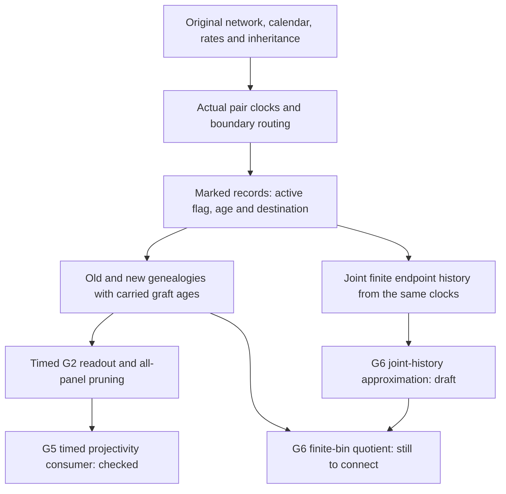

# What the timed G2 work added to the Lean source programme

Contributor: CLOUD-G6-SOL-ULTRA-20261007. Dated 7 October 2026.
This explains Nolan's question about the timed workflow; “GT's time” is
interpreted as timed G2. Actual verification and proposed consumers remain
separate throughout.

The central advance is that **topology, merger ages, intermediate observations
and the hidden inheritance register are derived from one original stochastic
source**. Time was not appended to a previously generated tree as an unrelated
annotation. That source connection makes the timing usable by later proofs.

## What “time” means

The original physical network gives each edge a calendar duration and a
positive constant pair-coalescence rate. Backward in time, sampled lineages
move through those actual populations. Two lineages occupying the same
population can merge according to its exponential clocks. At a demographic
boundary they move through the original routing operation. Above the root,
the positive ancestral population completes the genealogy.

Calendar duration and coalescent exposure are different: exposure on a
constant-rate edge is rate times duration. A proof that knows exposure alone
can describe merger probabilities while losing the absolute age of a merger.
The timed work retains both the original calendar and its rate bank.

Inheritance must remain the same experiment too. At a COMMON hybrid, the
original per-locus register decides the shared route. It is drawn once and
carried forward, rather than redrawn at every epoch or for every observation.
INDEPENDENT routing uses its actual current lineage roots. Several coordinates
from one locus are therefore a joint observation, not independent samples.

## What G2 actually promises

G2 asks whether sampling more copies and then keeping a selected subset
produces the same law as generating that subset directly. The unranked
version preserves genealogical shape. The timed version must also preserve
the relevant merger ages, calendar history and original routing/register
semantics.

This is demanding because deleting a leaf can hide a merger and collapse a
unary branch. A correct timed prune keeps the age of the merger that is still
the common ancestor of the retained leaves. It cannot reset the clocks or
substitute an independently generated sequence of snapshots. The source
proofs connect actual full and smaller observations, including empty/singleton
panels and already joined entering trees.

For example, suppose A and B join at age 1.3, C and D join at 1.7, and their two
subtrees join at 3.8. Keeping A and C leaves one merger at 3.8. It would be wrong
to assign their merger age 1.3 simply because that was the first event in the
larger sample. Timed G2 formalizes the source-consistent pruning principle.

## Why this grew into a substantial source stack

An endpoint tree is insufficient to prove every timed statement. The modular
construction now connects several representations, each retaining something
the next layer needs:

The finite `Code` keeps live genealogies, populations, ancestry and the
register. Its decoded event-history list is empty, so its last value cannot
by itself stand in for the complete timed history. Timed G2 separately stores
marked event records and a matrix of pair-MRCA ages. An actual graft writes
only the newly joined cross-operand pairs; old within-subtree ages survive.
The calendar fold carries this matrix through every later population change
and into ancestral completion.

The finite-history theorems are another important layer. They derive the
joint law of all requested earlier endpoints from the same clock vector.
Their renewal argument retains the old history and the original future
transition on each terminal-state fibre, including zero-mass fibres. This
is stronger than showing that each cut has the right marginal distribution.
Correct marginals alone can conceal a wrong correlation between cuts.

The observed timed output then comes from the actual completed path: its
topology and ages are tied to the same graft decoration. Measurability,
almost-sure clock regularity and fixed-age boundary nullity are source
theorems, not informal instructions to ignore inconvenient events.

## How G5 and G6 use it

G5 needs chronology to recover its promised structural targets. Its newly
checked consumer inherits actual timed all-panel projectivity and erases
only the latent register at the observation boundary. This confirms a real
source-to-readout connection. It does not yet prove that its frozen analytic
mixture is the actual conditional observed genealogy law; that remains a
separate identification bridge.

G6 needs finite computation and honest error bounds. Its original calendar
record is topology plus the bin of every internal merger at finitely many
cuts, without ranking unrelated mergers inside one bin. With a cut at 2 in
the example above, AB and CD both receive the first bin, while their parent
receives the later bin. The two old subtree tags must survive the last graft.

The new joint-history draft applies conditioned Poisson-prefix bounds to
the **entire endpoint vector**. Its product retained mass bounds one joint
readout without an extra factor for the number of coordinates. The bin-update
draft coarsens the inherited age update: preserve old tags and assign the
current bin only to newly joined pairs. For actual monotone mergers within
one bin, successive tag updates collapse to the initial/final endpoint test.

These are useful missing components, not the complete G6 timed adapter.
We still need original-rate-preserving insertion of read cuts, the actual
bin-constant interval/fold law, ancestral topology attachment and equivalence
with the bin of every internal node. Effective feasible cells, law tables,
closure nets and confidence/robustness consumers follow after their own gates.

## What the successful build establishes

[Run 37658528073](../2026-10-07-cloud-g5-sol-ultra-1557z/verification/evidence/g5-takeover-run-37658528073-PASS/README.md)
compiled all 170 selected custom modules: the inherited 164-module timed G2/G5
context plus five existing G6 modules and one G3 scalar module. Its full
environment inventory contains 3,856 declarations and 2,522 theorems, with
zero owned axioms, nonstandard transitive axiom rows or missing modules.
The inventory checks actual type/body references and includes generated
declarations; this is stronger coverage than a few headline axiom reports.

This is the whole **selected timed-source dependency context**, not every
Lean file in Commons or a complete G1–G7 theorem. Official Mathlib objects
were reused at the exact pinned revision. The new HistoryPrefix,
RationalCertificate and BinHistory derivatives were absent from that input
and need their own actual compiler receipt.

Kernel verification establishes that the stated proofs follow from their
definitions and premises. Source review must still establish that those
definitions and premises represent the original question. Clean axioms do
not by themselves rule out proving a weaker theorem or assuming an unproved
source bridge. We preserve both kinds of evidence.

## My assessment

The strongest part of this development is the same-source connection. It
turns a collection of useful graph/probability lemmas into machinery that
can justify statements about one actual genealogy experiment. The carried
old ages and joint-history law are particularly valuable because errors
there could leave every individual marginal looking correct.

The next decisive step is connected use: a finite-bin law and numerical
certificate that can be traced all the way back to the original source,
then an inference conclusion with the promised uncertainty and abstention.
That is why I am prioritizing these bridges over increasing declaration
counts. The progress is substantial and concrete, while the full timed G6
and actual-law G5 conclusions still deserve their explicit open labels.

For exact symbol/source locations see the [timed-history dependency map](../2026-10-07-cloud-lit-organization-1621z/g6-calendar-history-1722z/README.md),
[joint-history draft](JOINT-HISTORY-PREFIX.md) and [bin-update draft](SAME-BIN-UPDATE.md).

## Later source-component verification, 18:26 UTC

The170-module observation above is unchanged. The later
[successful117-report job](verification/evidence/g6-run-37663829244-PASS/README.md)
now formally checks rational cutoff termination, joint endpoint-vector
conditioning with a retained PMF past label, actual merger-bin updates and
the same-record finite-tag fold. It does not invent an event history inside
Code or reconstruct continuous past from a final snapshot. The next
[actual clock-support draft](ACTUAL-BIN-CLOCK.md) and
[finite-tag tree decoder](../2026-10-07-cloud-g3-contextual-source-1716z/finite-tag-decoder-1806z/README.md)
address precise remaining bin-calendar interfaces. They and the complete
expanded ownership inventory require their own later receipt. The original
calendar refinement, source attachment and full G6 consumers remain open.
