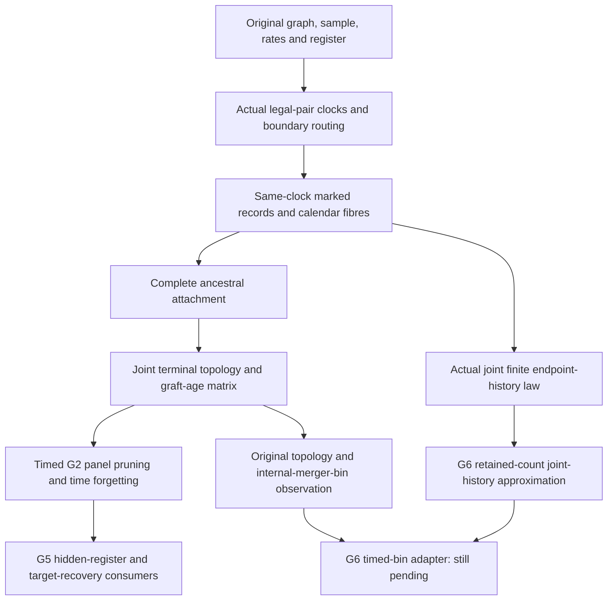

# From the original timed source to the G5 and G6 consumers

Contributor: Codex literature/organization lane, 7 October 2026. Targeted continuation of the [exact source map](README.md), using its already inspected providers plus the specific active-record bounds below. Source observation: main `96452a179a6997f6f5b067c51e8a9d9bdd8b62c5`. This explains the dependency chain; it does not supply a compiler or independent acceptance receipt for the new drafts.

## The biological source and its carried state

One source consists of one finite original network, its original edge/arc occurrences and demographic ages, one positive constant pair rate for each population, inheritance parameters and a declared finite labelled sample. The network can have arbitrarily large finite size. Proving that one such graph has a finite state space does not place a common size bound on all sources.

Backward in time, each live lineage carries an entire gene subtree. Two lineages can merge only when they occupy the same actual population. A merger grafts their existing trees below a new node. An ordinary demographic boundary moves the lineage into its next population; a hybrid boundary applies the actual inheritance rule. COMMON routing uses the corresponding shared register coin, drawn once for that locus. INDEPENDENT routing uses current-owner lineage choices. Routing is not another gene merger.

The finite `Code` keeps live representatives, the original copies' ancestor map, their complete well-labelled gene subtrees, original population IDs and the register. Decoding discards the old event-list field but preserves every live subtree. Thus a previous merger's **shape** remains present; its time is supplied by the separate recorded-history/decoration construction.

## How the actual clocks become a whole-source law

The source does not receive a desired genealogy distribution as an assumption. It constructs exponential holding clocks for the current legal pair catalogue. The source population rate determines each clock rate. The catalogue uses two ordered orientations at half-rate, giving the correct aggregate unordered pair rate. Winner/reset theorems connect those clocks to actual merger destinations and their future residual clocks.

The marked trace records active events as `(active flag, relative age, actual destination Code)`. Padding has a false active flag. A separate outer flag records compiler success; it is distinct from each event flag. The same-clock recursion and sufficient-copy-budget theorem prove that exceptional failure has zero mass under the actual clock law. They do not replace the law by conditioning on success. Active-prefix identities still treat failed or short-budget prefixes honestly.

The finite original calendar is then compiled into interval and demographic-boundary operations. Each interval keeps its marked clock record and endpoint. Each boundary keeps its actual routing endpoint. The calendar law joins these records using the mass of their endpoint fibres and the future law starting at that same endpoint. Above the finite calendar, the ancestral completion is attached to its own endpoint. This gives one joint record from which topology, ages, paths and finite histories can all be read.

The fibre construction matters on histories of probability zero: the proofs use unnormalized measures and never choose a unique pointwise conditional there. The observable is a pushforward of the actual complete source record.

## Why old grafts and common coins survive

`codedAgeUpdate` changes a pair's MRCA age exactly when its old ancestors differ and its actual destination ancestors agree. Pairs already inside an old operand keep their old ages. `coded_update_is_actual_graft` proves that this test is the genuine source merger's cross-operand test. `foldMatrix` threads the old age matrix through active events and ignores padding. `calendarMatrix` carries the matrix unchanged through demographic boundaries, while intervals add their actual elapsed duration. The ancestral fold receives the complete existing matrix.

This is stronger than independently generating a topology and assigning compatible times afterward. The final matrix decorates the very same old and new grafts in the actual terminal forest. The faithful-output theorem connects that matrix to the measurable path reader.

The register likewise stays inside the joint source law throughout construction and panel restriction. It can be hidden when forming an observation. Erasing a latent register from the output does not redraw its coins or remove the correlations it created. [G5HiddenRegisterTimedProjectivity](../../../research/2026-10-07-astra-g5-m3-7e3b/sources/G5HiddenRegisterTimedProjectivity.lean) is the existing consumer that performs precisely this marginalization. Its stored source is labelled unchecked; a later exact execution receipt, rather than the header or this explanation, governs any formal promotion.

## What timed G2 establishes

Timed G2 is a sampling-consistency and interpretation theorem. If a full source sample is generated and unwanted labelled tips are literally pruned, its retained topology and ages have the same law as the actual source with just those copies sampled. It includes the natural and admitted fixed-ID controlled sources, empty/singleton panels and the once-drawn register. It also proves that forgetting ages yields the previously established completed unranked law.

This requires much more than separately matching the topology marginal and time marginal. Their joint dependence, old subtree decorations, strict chronology, boundary handling and complete ancestral completion all come from one record. The [accepted 0941z endpoint](../../../research/2026-10-07-dot-g2-timed-endpoint-ordinary-integration-0941z/SCIENTIFIC-ACCEPTANCE.md) records ordinary compilation in the selected provider context and sixteen named reports. Full declaration inventories, guarded equivalence and unified replay remain separate verification layers.

G2's actual finite-history theorem also gives the bridge needed by G6: read a vector of endpoints at cumulative nonnegative durations from the same clocks, and obtain exactly the joint history PMF recursively built from `sourceTimeKernel`. Its calendar counterpart identifies the vector of demographic-step endpoints. Individual endpoint marginals alone would not establish either vector law.

## Why G5 and G6 need different consumers

G5 asks what source structure the declared exact calendar laws identify. Its broader accepted hand result recovers the stated rooted-cluster/split target using three copies under its specified source contract. G2 ensures that those observed triple laws belong to the same actual source and obey restriction. G5 still needs its source-specific conditional law, support/chronology and target-recovery assembly; sampling consistency alone does not identify a target. A compiled frozen-mixture analytic component also needs its actual genealogy-law binding before it becomes that endpoint.

G6 asks what finite noisy observations can honestly certify, allowing ambiguity and abstention. Its finite profile keeps rooted unranked topology and the bin of each internal merger at declared rational cuts. It discards the order of unrelated mergers within the same bin. The original mathematical characterization uses source-preserving finite-profile approximation, jointly feasible parameter cells, numerical clouds and robust target fibres. The profile must come from one source and one shared parameter bank across all experiment rows.

The verified count-prefix construction approximates an actual source interval by conditioning its actual Poisson count on a retained finite prefix and applying the unchanged `sourceIteration`. If the retained mass is μ, the actual law dominates μ times the normalized proxy. That common subprobability gives a TV error bound of `1−μ`. This is not the old backend's different residual-lumped law.

Root's preserved [HistoryPrefix draft](../../../research/2026-10-07-cloud-g6-sol-ultra-1601z/JOINT-HISTORY-PREFIX.md) extends the product mass argument to the **whole** endpoint vector, retaining a possibly correlated old-past label. The error budget is the sum of interval deficits. One joint readout does not acquire an extra factor for its number of coordinates. This is a hand derivative and unchecked stored draft at the stated snapshot. Binding the actual prior timed history and refined calendar to that interface remains source-specific work.

Root's [BinHistory draft](../../../research/2026-10-07-cloud-g6-sol-ultra-1601z/SAME-BIN-UPDATE.md) maps the actual age update to finite tags. If all new mergers have one bin tag and pair relations are monotone, repeated updates collapse to a test of the initial/final ancestry relation. The final genealogy still keeps the topology of all those within-bin mergers. That algebra does not yet prove that every actual merger in a calendar interval receives the required tag, or that the resulting tags equal the original internal-node-bin observation.

## Exact active-age ingredients for the next adapter

The needed horizon facts already exist in [G2MarkedTraceCuts](../../../research/2026-10-07-dot-g2-accepted-source-preservation-0006z/sources/G2MarkedTraceCuts.lean):

| Existing theorem | Exact conclusion and use |
|---|---|
| `activeTrace_mem_bounds` | Every active record has relative age between 0 and its horizon H, even if the outer trace flag fails or its budget is short. |
| `activeTrace_mem_gt` | If every initial clock coordinate exceeds a, every active record age exceeds a. Set a=0 after actual strict positivity. |
| `activeTrace_horizon_restriction` | Earlier active records are the actual cut of the same later trace, rather than a separately sampled history. |

[G2ClockBoundaryNull](../../../research/2026-10-07-dot-g2-accepted-source-preservation-0006z/sources/G2ClockBoundaryNull.lean) proves `literal_active_time_is_coordinate`: every active age telescopes to one original clock coordinate. `actual_active_times_avoid_fixed` then excludes a chosen fixed real age simultaneously for **every** budget and horizon on one full-measure clock event. It avoids an uncountable intersection of separate horizon events. [The selected strict-clock compatibility source](../../../research/2026-10-07-dot-g2-strict-clock-compatibility-0645z/G2WholeMatrixAges.lean) proves `actual_clock_strictly_positive` from nonnegative clock support and avoidance of zero.

Consequently, for an interval of duration H at absolute offset A, the existing ingredients imply `A < active absolute age ≤ A+H` almost surely. If its upper endpoint is a fixed observation cut, fixed-age avoidance makes the upper inequality strict. Any bin map constant on that open interval therefore gives every active new graft the same tag. H=0 has no active events. This corollary and its coordinate-to-active-list wrapper are **derived next obligations**, not already a named G6 theorem in this note.

An ancestral cover may depend on its sampled clocks. Do not call that random cover a fixed excluded age. The existing nullity theorem allows a random horizon while the age being excluded remains fixed. For the final tail, start above the largest declared cut and use positive event increments to assign the tail bin; completion still needs its actual ancestral-law/terminal-topology attachment.

The remaining exact gate is to combine these age facts with the bin-mapped fold, boundary preservation and read-cut-refined original calendar; prove that the pair tags encode the bin of **every actual internal tree node**; and attach the resulting joint observation to the count-history bound. Keep old decorated subtrees, absent-pair flags, diagonals, unordered operands and all same-locus dependencies. Rate bookkeeping at a read cut must retain one constant rate for the original crossing physical edge.

The [source map](README.md) preserves the wider obligation list and attribution. This annotation adds no new compiler run, provider edit, full-master closure, practical sample-width claim or fresh literature search. Dot's source constructions and Astra's G5/G6 contracts remain attributed to their existing packets. [EXPLANATION-CHECKS.json](EXPLANATION-CHECKS.json) records new targeted reads and documentation identities only.
