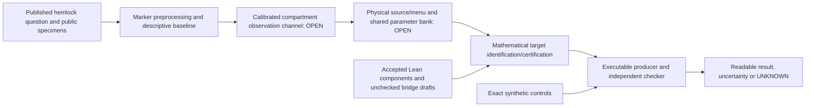

# Checkpoint dependency and failed-route map

The original master statements and closest accepted results remain pinned in each lane's SOURCE-PINS/dependency receipts and the unchanged [whole-scope record](../2026-10-07-dot-full-scope-reconciliation-1003z/CURRENT-SCOPE.md). This map describes integration, not new master closure or historical novelty.

| Original statement / accepted predecessor | Hand/source and Lean connection | Implementation and actual validation | Unresolved implication |
|---|---|---|---|
| Original nine-parameter source identifiability and full-domain interval localization; original AB-profile arithmetic already succeeded | [Practical recovery pins](practical/RECOVERY.json) and original dependency manifests; no claim of Lean extraction | Native signed-nine differential gate; unchanged original producer and independent whole-journal checker; [finite-data result](practical/finite-data/RESULT.json) | Admitted empirical six-copy/two-site clock-JC observations and valid simultaneous confidence; signed comparator does not prove source existence |
| Original inheritance boundary with fixed ordered parents and stored Bool | [Source correspondence](correspondence/SOURCE-CORRESPONDENCE.md), original Python/native pins and accepted initialization conventions | Captured authenticated Python source; full joint law/COMMON/table/boundary/serialization tests | Native binary, original whole-calendar serialization and joint-law correspondence for the complete compiler |
| G5 full original-X initialization, conditional genealogy-to-germ/posterior and M3/HG decoding; accepted timed projectivity and posterior providers | [G5 hand/source map](g5/HAND-SOURCE-CORRESPONDENCE.md); `G5OriginalProgramSurvival.lean`, `G5OriginalSelectedPosterior.lean` are unchecked | Static dependency stages reuse 67/93 accepted providers; no competing compilation | Physical time-at-t/event identification, all-route support, five-row germs, safe deletion and complete target assembly |
| G6 one shared feasible assignment over original source/menu/protected-cut/cross-graph witnesses; accepted G1/Q/S transport | [G6 source map](g6/DEPENDENCY-MAP.json); fixed rational calendar shared-bank hand result and unchecked six-body Lean draft | Original edge/hybrid cells and shared-rate ties replayed by `shared_bank_gate.py`; 12 controls/42 exposures | Variable ages, full biological source charts, protected menus, wrong-source image distances and effective coverage/stopping |
| Raubeson empirical disagreement; existing plant observation-bridge requirements | [CWU traceability](g6/CWU-TRACEABILITY.md) and [full application map](g5/APPLICATION-TRACEABILITY.md) | Synthetic nuclear/plastid laws run through original source producer/checker; empirical request refuses. Separate real public-marker derivative retains its own manifest | Actual orthology/paralogy, ancestry blocks, compartment channel and calibrated uncertainty on those same inputs; no capture conclusion |
| Haplotype interaction and RNA endpoint definitions; recovered original contract and mock tests | Existing owned molecular contracts plus [access design](ACCESS-PLAN.md); no biological or whole-app Lean certificate | [Public recovered application](../../applications/molecular-analysis/), original Rust/Python tests; four matched scenario policy exercise | Authorized service terms/data/account budget and bounded transport; prediction-to-measurement calibration remains distinct |

Failed or insufficient routes are explicit:

- The 1,024-locus bands cannot support the current 1/20 all-nine objective because the same bands contain the two separated source points. More inversion of those bands cannot erase that ambiguity.
- A narrow-input arithmetic pass or pair comparator is not a complete empirical inverse or a confidence theorem. The native stage currently follows the original checker; a runtime improvement is unproved.
- Loading a verified path through Python's bytecode loader can execute different cached bytes. The correspondence derivative executes the captured verified buffer; the practical CLI receives its own reviewed correction.
- The first G6 witness replay omitted inherited-cell coverage. Its corrected derivative checks that coverage and preserves the earlier evidence.
- The older failed181 Lean run preserved179. Its repaired successor is independently accepted; successful-looking recovery output from the failed run remains excluded.
- Dryad metadata are available but the original alignment downloads returned401/403. Public GenBank records provide a separate, transparently processed baseline; they do not silently become the published full alignment or model.
- Two disagreeing trees or abstract sister-clade descriptions do not prove chloroplast capture. Separately fitted compartment laws do not demonstrate one shared biological source.
- AlphaGenome single-variant scores do not determine combined haplotype effects. The inherited metadata-per-prediction provider also fails the proposed five-attempt live budget before retries; access remains offline.
- Dot's finite-cap constructions and conditional repair/stopping interfaces do not establish all-cap counterexamples, all-original-rival bounds or observation-only termination. See its exact [reviewed handoff](../../handoffs/2026-10-07-codex-cloud-sol-ultra-g5-g6/inbox/G6/20261008T090300Z-DOT-REVIEWED-G4-ROUTES.md).
- Dot's later [signed-time saturation handoff](../../handoffs/2026-10-07-codex-cloud-sol-ultra-g5-g6/inbox/G6/20261008T093700Z-DOT-SIGNED-TIME-ALL-CAP.md) retains a stronger all-finite-cap result in an enlarged source group. Actual positive-time conversion and hazard bounds remain open. The handoff's working fixed-word clearing audit is not a reviewed general obstruction to every alternative source factorization.

One stronger empirical observation/source theorem could connect several of these components. The next application step therefore targets the shared data-to-source contract, instead of adding differently named local modules to the same unfinished bridge.
